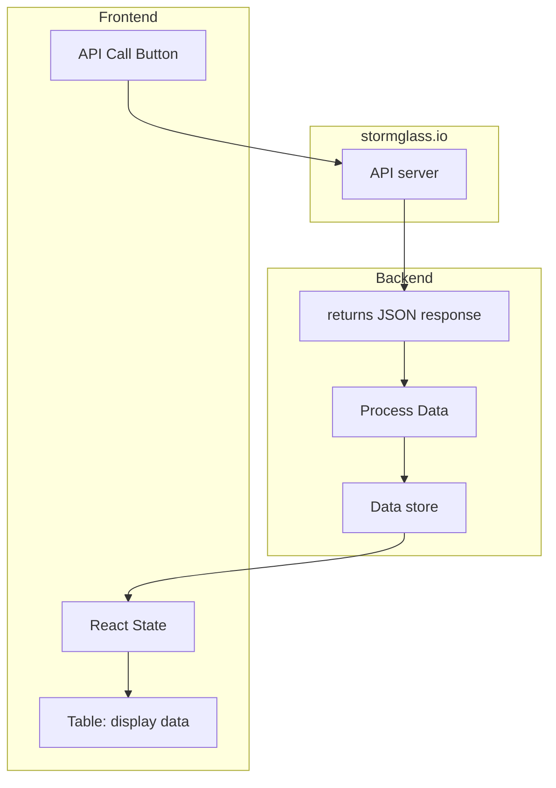

# README

## Architecture Overview

This document describes the architecture of the Tide & Weather Guide application.

### Mermaid Diagram



### Description
- The frontend includes an API call button that triggers a request to the backend.
- The backend (Node.js) fetches data from stormglass.io, processes the JSON response, and stores it in the data store.
- The frontend reads from the data store using React's useState and presents the data in a table.


## Resources
- [Netlify-DB](https://docs.netlify.com/build/data-and-storage/netlify-db/)

## Dev commands:

``` bash
rm -r ./migrations
```

``` SQL 
DROP VIEW weather_solar;
DROP TABLE tides, solar, weather, metadata;
DROP TYPE meta_source, tide_type;
```

``` bash
npm run db:generate
npm run db:migrate
```

To run the server locally for development run: `npm run dev` and navigate to localhost:8888
