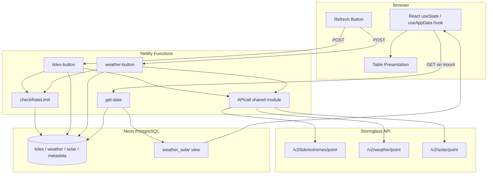

# Tide & Weather Guide

[Repository](https://github.com/sifr01/tide-n-weather-guide/)

A full-stack personal portfolio project that displays tidal extreme events and hourly weather/solar data for **Viana do Castelo, Portugal**, served entirely within free-tier limits.

---

## Table of Contents

1. [Purpose](#purpose)
2. [Tech Stack](#tech-stack)
3. [Architecture](#architecture)
4. [Project Structure](#project-structure)
5. [Netlify Functions](#netlify-functions)
6. [Database Schema](#database-schema)
7. [Environment Variables](#environment-variables)
8. [Local Development](#local-development)
9. [Database Commands](#database-commands)
10. [Resources](#resources)

---

## Purpose

Three problems, one solution:

- **🌐 Hosting for free** — React frontend served as a static site on Netlify; all backend logic runs in serverless functions invoked on demand (no idle server cost).
- **📡 API calls for free** — The [Stormglass](https://stormglass.io) marine API is rate-limited on the free tier. Data is fetched manually via a button press and cached in a PostgreSQL database, so every subsequent page load is served from the cache at zero API cost.
- **🛠️ Showcasing skills for free** — Demonstrates a full-stack TypeScript project (React, Drizzle ORM, PostgreSQL, Netlify serverless functions) with no running cost.

---

## Tech Stack

| Layer | Technology |
|---|---|
| Frontend | React 19, TypeScript, React Router v6 |
| Serverless functions | Netlify Functions (Node.js / TypeScript) |
| ORM | Drizzle ORM |
| Database | PostgreSQL via [Neon](https://neon.tech) (serverless) |
| Build / hosting | Netlify (free tier) |
| External API | [Stormglass.io](https://stormglass.io) |

---

## Architecture

### Data flow



### Description

- On app load the `useAppData` hook makes a single `GET /.netlify/functions/get-data` call and stores tides + weather/solar rows in React state. Child pages receive this data as props — no additional DB calls when the user switches tabs.
- The **Refresh** buttons on the Tides and Weather pages `POST` to `tides-button` or `weather-button` respectively. Each function checks the rate-limit against the `metadata` table before hitting the Stormglass API.
- After a successful refresh, the hook's `refetchTides` / `refetchWeatherSolar` methods re-call `get-data` to update the displayed table in-place (no full page reload).
- All DB access is gated through Netlify functions — `DATABASE_URL` is a server-side secret and is never exposed to the browser.

---

## Project Structure

```
netlify/functions/       # Serverless function entry points
  APIcall.ts             # Shared Stormglass fetch module (API key, GPS coords, mock toggle)
  checkRateLimit.ts      # Shared rate-limit helper (queries metadata table)
  get-data.ts            # GET — serves cached tides + weather_solar to frontend
  tides-button.ts        # POST — fetches tidal extremes, truncates + re-inserts tides table
  weather-button.ts      # POST — fetches weather + solar, truncates + re-inserts both tables

src/
  App.tsx                # Root component: routing, loading/error banners, data fetch
  hooks/useAppData.ts    # Custom hook: fetches all DB data once on mount
  pages/
    Home.tsx             # Explains the project purpose
    Tides.tsx            # Displays the tides table; triggers tides-button refresh
    Weather.tsx          # Displays the weather/solar table; triggers weather-button refresh
  components/Nav.tsx     # Persistent navigation bar
  db/
    schema.ts            # Drizzle ORM schema (source of truth for DB structure)
    index.ts             # Drizzle client instance
  types/data.ts          # Shared TypeScript types (TideRow, WeatherSolarRow)

model/                   # Mock JSON files used when USE_MOCK_DATA="true"
  tides.json
  weather.json
  solar.json
```

---

## Netlify Functions

| Function | Method | Purpose |
|---|---|---|
| `get-data` | GET | Returns all rows from `tides` table and `weather_solar` view |
| `tides-button` | POST | Rate-limited; TRUNCATEs `tides`, bulk-inserts fresh data from Stormglass, appends to `metadata` |
| `weather-button` | POST | Rate-limited; TRUNCATEs `weather` + `solar`, bulk-inserts fresh data, appends to `metadata` |
| `checkRateLimit` | (shared) | Queries `metadata` for the last `fetched_at` timestamp; enforces per-source cooldown |
| `APIcall` | (shared) | Holds the API key, GPS co-ordinates, and `callAPI()` function; switches between live and mock data |

**Rate limits:**

| Source | Cooldown |
|---|---|
| `tides` | 24 hours |
| `weather` (+ solar) | 6 hours |

---

## Database Schema

Defined in `src/db/schema.ts` (Drizzle ORM). See `src/db/SCHEMA_README.md` for full column-level documentation.

| Object | Type | Description |
|---|---|---|
| `tides` | Table | Tidal extreme events (high/low) — Unix epoch PK, height (numeric), type (enum) |
| `weather` | Table | Hourly weather from multiple model sources (gust, pressure, water temp, wave height, wind) |
| `solar` | Table | Hourly solar/UV data (UV index from multiple sources) |
| `metadata` | Table | Append-only audit log of every API call (source, cost, timestamps) |
| `weather_solar` | View | LEFT JOIN of `weather` and `solar` on `time` — queried by `get-data` via raw SQL |
| `tide_type` | Enum | `'high' \| 'low'` |
| `meta_source` | Enum | `'tides' \| 'weather' \| 'solar'` |

---

## Environment Variables

Copy `dotenv_example` to `.env.local` and fill in your values:

```bash
# PostgreSQL connection string (Neon) — server-side only, never exposed to browser
DATABASE_URL="postgresql://neondb_owner:..."

# Stormglass API key — obtain from https://dashboard.stormglass.io
API_KEY="your_stormglass_api_key_here"

# Set to "true" to use local JSON mock files instead of live API calls.
# Any value other than the exact string "true" is treated as live mode.
USE_MOCK_DATA="true"
```

---

## Local Development

Run the full stack (React dev server + Netlify functions) locally:

```bash
npm run dev
```

Then open [http://localhost:8888](http://localhost:8888).

The Netlify CLI proxies the React dev server (port 3000) and exposes the functions on the same port (8888), so `/.netlify/functions/*` routes work identically to production.

---

## Database Commands

> **Note:** The `migrations/` SQL files are generated automatically — do not edit them by hand. Modify `src/db/schema.ts` instead, then regenerate.

**Regenerate and apply migrations:**

```bash
npm run db:generate
npm run db:migrate
```

**Reset the database (drop everything and start fresh):**

```bash
rm -r ./migrations
```

```sql
DROP VIEW weather_solar;
DROP TABLE tides, solar, weather, metadata;
DROP TYPE meta_source, tide_type;
```

Then re-run `db:generate` and `db:migrate`.

**Open Drizzle Studio (DB browser):**

```bash
npm run db:studio
```

---

## Resources

- [Netlify Docs](https://docs.netlify.com/)
- [Netlify DB (Neon)](https://docs.netlify.com/build/data-and-storage/netlify-db/)
- [Drizzle ORM](https://orm.drizzle.team/)
- [Neon Serverless](https://neon.tech/docs/serverless/serverless-driver)
- [Stormglass API](https://docs.stormglass.io/)
